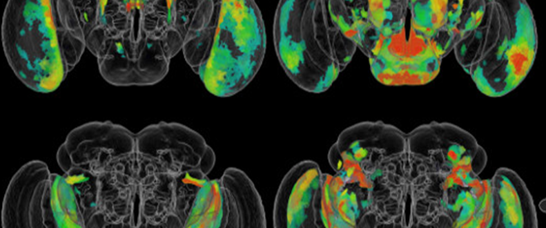
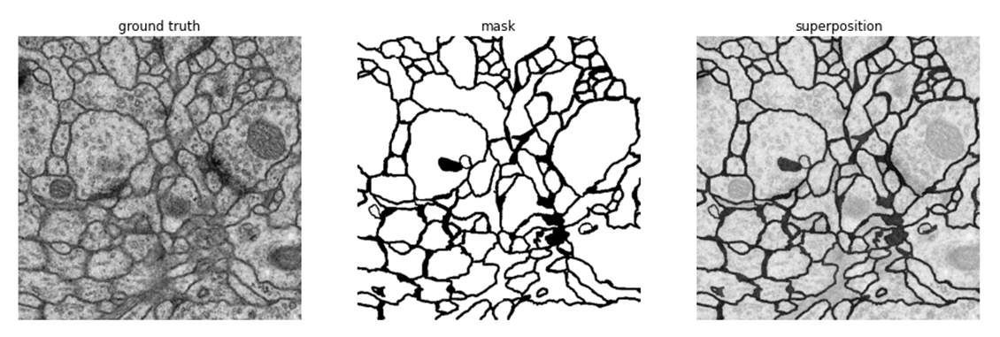
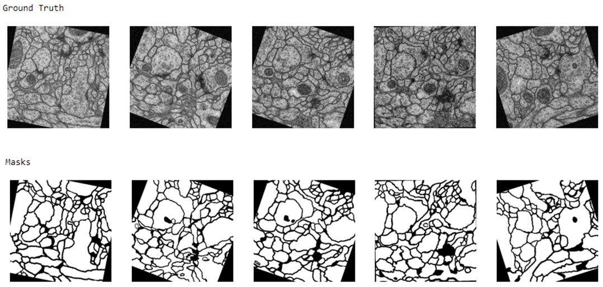
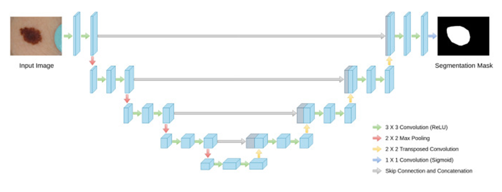
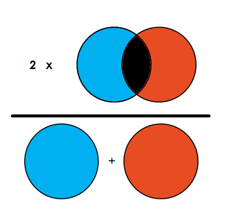
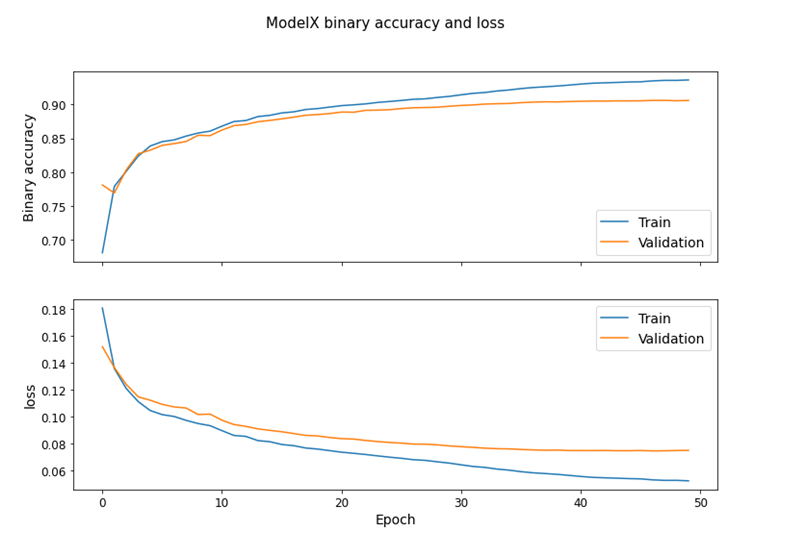
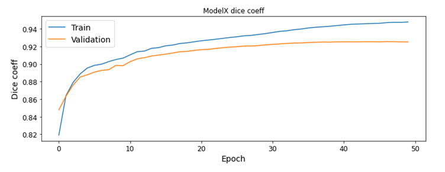
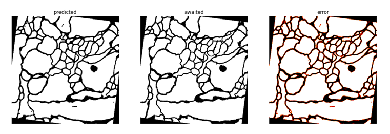
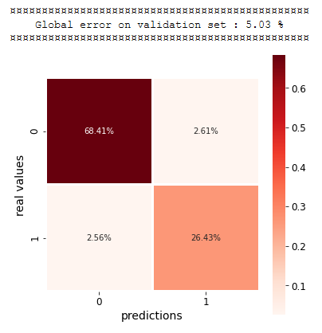

# P32_medical_image_segmentation
CNN, U-Net, Semantic Segmentation

# Segmentation des Images de la Microscopie Électronique
#### Ludivine, Luigi, Jérémy

  

## Contexte du projet
L’IA est aujourd’hui omniprésente dans la littérature scientifique de l’imagerie médicale, d’autant plus depuis le développement de nouveaux algorithmes appelés réseaux de neurones convolutifs.
En effet, à ce jour, l’IA est très utile dans le domaine de l’imagerie, sur deux volets : la classification des images et la segmentation des organes. Les algorithmes pour classifier les images peuvent permettre d’aider au diagnostic en classant une image dans une catégorie particulière de pathologie. Les algorithmes pour segmenter les images sont couramment utilisés sur tous les types d’imagerie et en routine au CHRU. C’est ainsi que l’IA permet un gain de temps aux praticiens à la fois pour le diagnostic ou lors d’interventions. Elle présente aussi l’avantage de contourner certains biais liés à l’interprétation de l’opérateur.

## Modalités d'évaluation

* Description des données
* Présentation de l'architecture utilisée
* Conclusion (avantages et inconvénients, concurrents, recommandations…)

## Introduction 
Pour ce projet sur la segmentation, nous nous proposons d’étudier et traiter les images résultant de la publication d’A.Cardona et al. (2010) sur le système nerveux central de larves de *Drosophilia melanogaster*, modèle biologique couramment utilisé dans le domaine de la génétique et de la biologie du développement. L’article présente ici les avancées dans l’étude des microstructures neurophiles (qui qualifie tout élément qui se fixe essentiellement sur le système nerveux) afin d’établir une comparaison entre vertébrés et insectes.

  

## Preprocessing
Le projet a été réalisé sur Google Colab, le dataset a été importé et dézippé à cet effet. Les paths ont été définis afin de poursuivre notre traitement et lancer le modèle.

Nous disposons des images de l’article (train et test) et de leur mask  (labels) en format TIFF qui nous permettront de segmenter les éléments souhaités (ici les cellules neuronales / synapses). Pour traiter les différentes images prévues pour l’apprentissage du modèle et d’évaluation, une fonction de conversion Tiff – PNG est réalisée.

## Construction du set d’apprentissage
Les images ont été transformées par skimage,  une librairie de traitement d’image afin d’obtenir les matrices qui seront ensuite gérées par le modèle. La première image et son mask  sont affichées ainsi que la superposition des deux afin de vérifier que les paths ont bien été définis.

  

## Data Augmentation
Pour augmenter notre jeu de donnée, une fonction a été créée en utilisant skimage. Des copies des images et de leur mask ont été transformées en incluant des rotations à différents degrés, des ajouts de bruit ou encore des retournements horizontaux, verticaux ou pas de façon aléatoire. 800 images (512x512 pixels) ont donc été générées.

  

Les matrices des images et des labels d’entrainement ainsi que celles d’évaluation ont été sauvegardées. Après la normalisation des données, le modèle a pu être construit.

## Construction du modèle
Le modèle présente une architecture Unet, couramment utilisée dans la segmentation d’imagerie médicale. Il est composé de couche de traitement de convolution et de déconvolution afin d’obtenir le mask  produit en sortie. Un padding same a été attribué afin d’éviter les problèmes de concaténation et pour simplifier l’écriture du réseau.

  

A chaque fois que nous faisons un traitement de convolution, nous multiplions le nombre de carte de caractéristique par 2. A l’inverse, nous divisons le nombre de carte de caractéristique par 2 à chaque concaténation ascendante afin d’obtenir notre mask de sortie qui n’a qu’un seul type d’objet à détecter. Nous activons cette dernière couche avec la fonction Sigmoid (classification binaire).

La métrique d’évaluation choisie est le F score, ou coefficient de Dice qui est recommandée pour ce genre de problématique. Cet indicateur de similarité peut être traduit sous forme vectoriel pour s’en servir de fonction de perte.
Comme représenté ci-contre, plus il y a de similarité, plus le score est élevé. On multiplie par 2 ce nombre pour obtenir un indice allant de 0 à 1.

  

*Nous aurions aussi pu utiliser le coefficient de Jaccard (IoU). Les résultats seraient sensiblement les mêmes.*

La métrique *Binary.Accuracy* est aussi ajouté afin de calculer la fréquence à laquelle les prédictions correspondent aux étiquettes binaires. Enfin, un callback est aussi défini afin de permettre au modèle de relevé le meilleur score obtenu durant l’apprentissage.

Après 50 Epochs, un plateau est atteint pour la fonction de perte et l’Accuracy.

  
  

  
## Evaluation du modèle
Une fonction show_result_on_an_image() a été construite pour comparer le mask réel avec celui du modèle. Cette fonction permet de visualiser et calculer le nombre de pixels n’ayant pas été correctement prédit par le modèle (ici affiché en rouge). Sur l’exemple ci-dessous, près de 4% des pixels ne sont pas attribués correctement.

  

Une évaluation global a aussi été effectué sous forme de matrice de confusion en prenant en compte la proportion de pixels blancs et noirs attribuée sur les images labels. Seulement 5% des pixels sont mal attribués.

  

## Conclusion

Grâce à la data augmentation, nous avons pu générer 800 images et labels qui ont servi à entrainer notre modèle. L'architecture UNet, prévue pour la segmentation d'image biomédicale a été privilégiée. Le coefficient de Dice a été utilisé comme métrique d'évaluation qui se base sur le principe de similarité entre deux images et nettement plus performant que la *binary.crossentropy*. Cette démarche nous a permis d'obtenir un modèle fonctionnelle aux résultats satisfaisants.

______
_Pour utiliser le notebook sur colab :_ 
_Créez un dossier `P32_medical_image_segmentation` à la racine de votre Google Drive_ 
_Copiez-y le fichier data_seg.zip_ 
_Synchronisez. C'est tout._
